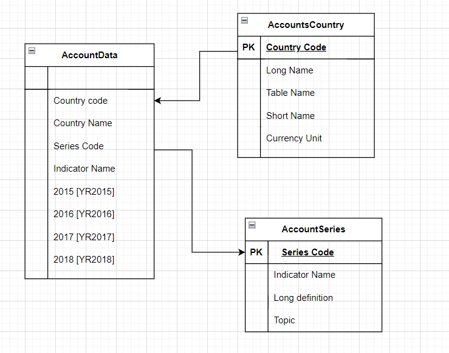
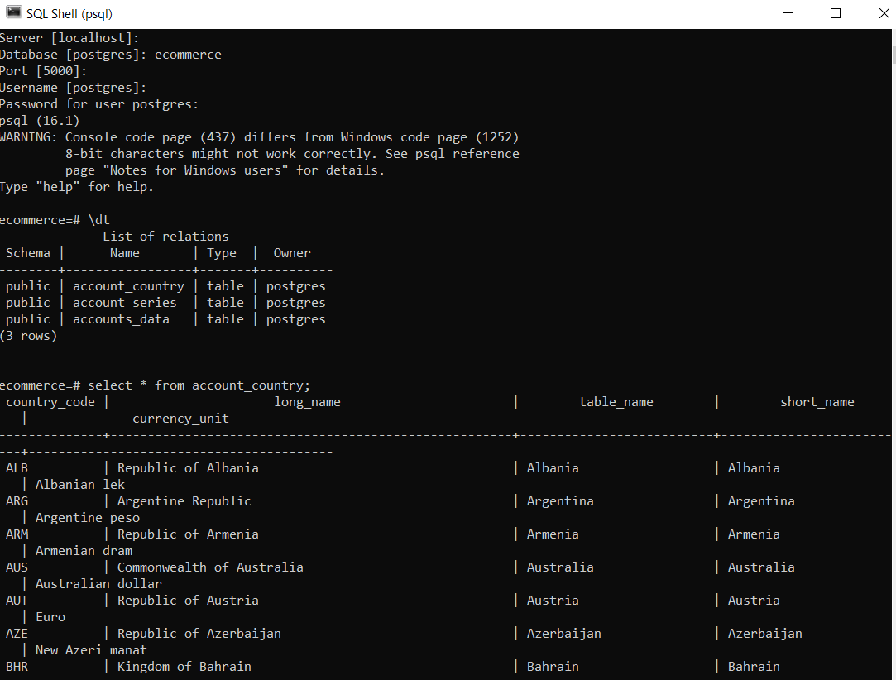

## Accounts_ETL_Project

This project is a simple Extract Load and Transform process in Python. I extracted data from a csv file, Transformed the data (cleaning, removal of duplicates and some missing values), and loaded it into a Postgres Database.

#### Data Model created for Project

#### Data Available for Analytics in Postgre DB

